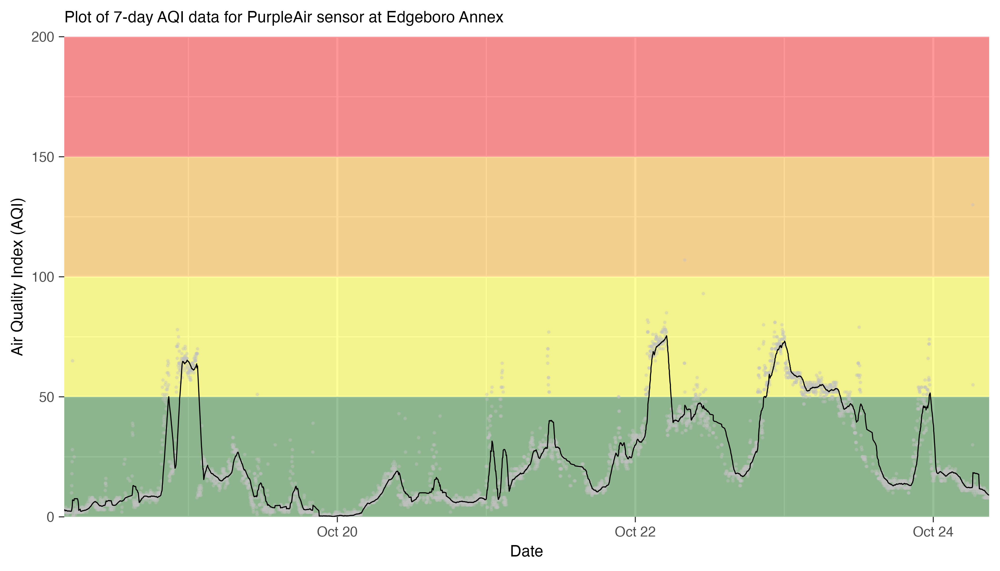

## PurpleAir plots using targets

This repository uses the [`targets` package](https://docs.ropensci.org/targets/) to build 7-day plots of PurpleAir data for sensors throughout the Lehigh Valley. Run `tar_make()` to execute `_targets.R` .

Install all packages needed to run:

    install.packages(c('tidyverse','lubridate','rdrop2','formattable','zoo'))

Running `tar_make()` will produce 9 plots like this for each sensor:

